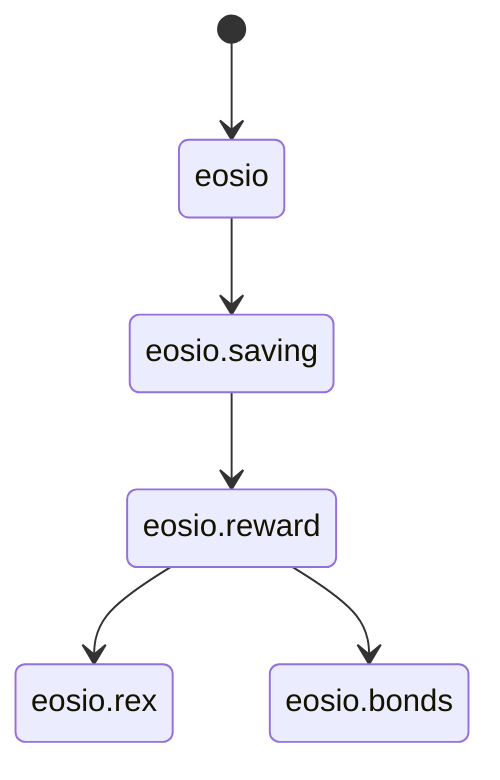

# EOS Reward (`eosio.reward`) [](https://github.com/eosnetworkfoundation/eosio.reward/actions/workflows/test.yml)

## Overview

The `eosio.reward` contract handles system reward distribution.



## Strategies

The `eosio.reward` contract is designed to distribute a linear amount of rewards to a single or multiple strategies. Each strategy has an associated weight which determines the percentage of rewards that will be distributed to that strategy.

| Strategy      | Description |
| ------------- | ----------- |
| `eosio.rex` | Donate to REX - Distributes rewards to REX pool which is distributed to REX holders by staking for 21 days |
| `eosio.bonds` | Donate to Bonds - Distributes rewards to Bonds pool which is distributed to Bonds holders from 4 weeks up to 1 year |


## Development and Testing

### Build Instructions

To compile the contract, developers can use the following command:

```sh
cdt-cpp eosio.reward.cpp -I ./include
```

### Testing Framework

The contract includes a comprehensive testing suite designed to validate its functionality. The tests are executed using the following commands:

```sh
$ npm test

> test
> bun test
```
